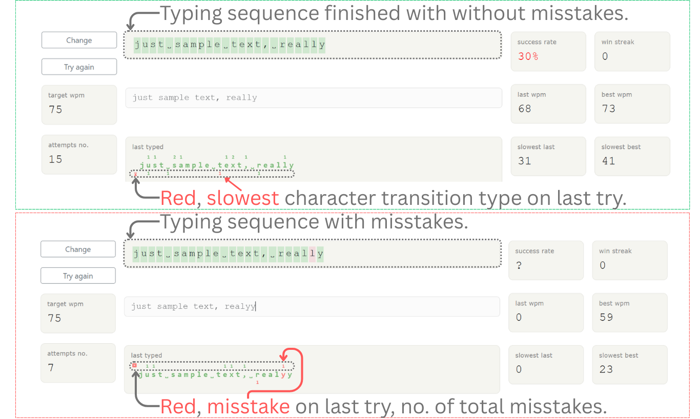

# Small Sequence Typing Drill (SSTD)



## Description
**SSTD** is a lightweight, browser-based web app to help you practice typing speed and accuracy. It uses **local storage** to save a single short typing sequence (max 35 characters), making it fast, private, and easy to use.  

You can test your typing performance, track your WPM, and identify mistakes in real time, without any server or external data collection.

---

## Features
- **Local Storage**
  - Stores the last typing drill at key `"a+3_sstd_last_drill"` in JSON format.
  - Stores the word stat data (accuracy and speed) at key `a+3_sstd_words_stats`.
    - also stores drill history queue in order for reusing previous drills
  
- **Default Sequence**
  - If no previous sequence is found in storage, the default drill is:
    ```
    "sample text sequence, "
    ```
  
- **Stored Drill Data Structure**
  ```json
  {
    "drill_text": "sample text sequence, ",
    "wpm_last": 0,
    "wpm_best": 0,
    "wpm_history": [60, 75, ...],
    "last_typed_sequence": "text typed",
    "char_mistakes": [0, 0, 0, 1, 1, 0, ...]
  }
  ```
  ## Typing Rules
- Backspace and Delete keys are **disabled**.  
- Pressing **Enter** immediately restarts the drill.  
- Timer starts on the **first key press** and stops on the **last key press**.  
- Also intermediate timers are checked for measuring next char typing speed starting from the second character.
- If any mistake occurs, `wpm_last` is recorded as 0.  
- The current character is highlighted visually.  
- Typing advances even when a mistake is made.  
- On the settings there is a option to   freeze the typing box after 2 consecutive mistakes until Enter is pressed (also try again button will unfreeze.).

## Target WPM
- Input a target WPM for each drill.  
- If at least 3 consecutive attempts meet or exceed the target and success rate is above 50%, with at least 10 attempts completed, congratulation indicator is displayed.  

## Word stats analysis development

### Data that will be calculated for words stats

```JS
{
  "accuracyQueue": [
    { "word": "responsibilities", "score": -1.0416, "worstIndexes": [5, 12] },
    { "word": "citizens", "score": -1.0310, "worstIndexes": [2] }
    // ... top 19 worst accuracy words
  ],
  "speedQueue": [
    { "word": "own", "score": -1.0820, "worstIndexes": [1] },
    { "word": "responsibilities", "score": -1.0219, "worstIndexes": [18] }
    // ... top 19 worst speed words
  ]
}
``` 

### Calculation of scores 
Calculation only starts when attempts >= 10 for the accuracy and attemptsClean >= 5

0. The Accuracy Score (Mistake Density)This formula calculates the probability of making a mistake on any given character within that specific word.$$\text{Accuracy Score} = \frac{\sum \text{Mistakes in Word}}{\text{Word Length} \times \text{Total Drills}}$$
1. 
2. The Speed Score (Hesitation Density)This uses your slowestWpmCharCount to find where your rhythm breaks, even if you didn't actually press the wrong key.$$\text{Speed Score} = \frac{\sum \text{Slow Counts in Word}}{\text{Word Length} \times \text{Total Clean Drills}}$$

### User Interface result presentation
In a modal 1 categories of top words will be shown:
- top 4 words with worst accuracy
- top 4 words with worst typing speed
A word could be in both categorie, high score is a bad result, that is words with the highest scores will compose the top 4.


# Super Simple Typing Drill (SSTD) - History System Documentation

## 1. Overview
This document defines the persistent data structure and logic for the Super Simple Typing Drill (SSTD) history system. This system utilizes an **Adaptive Level-based Spaced Repetition (SRS)** algorithm. It optimizes muscle memory by increasing review intervals as mastery is demonstrated, while rewarding high-efficiency practice with performance-based bonuses.

## 2. Storage Key
- **Key:** `a+3_sstd_words_stats`
- **Format:** JSON Object containing an array named `historyQueue`.

## 3. Data Schema (The Drill Object)
| Property | Type | Description |
| :--- | :--- | :--- |
| `drillText` | String | The unique text sequence. Used as the primary key. |
| `wpmTarget` | Number | The specific WPM goal set for this drill. |
| `createdAt` | Number | Unix timestamp (ms) of when the drill was first created. |
| `succeededTimes`| Number | **The Level.** Increments on mastery; resets to 0 on failure. |
| `attempts` | Number | The number of tries taken in the session where mastery was achieved. |
| `nextReviewAt` | Number \| null | The calculated Unix timestamp for the next review session. |

## 4. Operational Logic

### A. Mastery Criteria
A drill is considered **"Succeeded" (Mastered)** and eligible for a Level-Up when:
1. The user achieves a **3-win streak** in the current session.
2. The user has performed at least **10 total attempts** in the current session.
3. The success rate is **≥ 50%** over the last 10 attempts.

### B. Adaptive Spacing Progression (The Ladder)
Upon mastery, the `nextReviewAt` interval is calculated by taking a **Base Interval** and applying a **Performance Multiplier** based on the number of attempts required to pass.

#### Tier 1: Base Intervals
| Level (After Success) | Base Interval | Milliseconds (ms) |
| :--- | :--- | :--- |
| **Level 1** | 1 Day | `86,400,000` |
| **Level 2** | 3 Days | `259,200,000` |
| **Level 3** | 1 Week | `604,800,000` |
| **Level 4** | 1 Month (30d) | `2,592,000,000` |
| **Level 5+** | 3 Months (90d) | `7,776,000,000` |

#### Tier 2: Performance Multipliers
| Session Attempts | Multiplier | Description |
| :--- | :--- | :--- |
| **1 - 50** | **2.0x** | **High Performance:** Mastery achieved rapidly. |
| **51 - 150** | **1.5x** | **Average Performance:** Standard learning curve. |
| **> 150** | **1.0x** | **Standard:** Mastery required significant repetition. |

**Formula:** `NextReview = Now + (BaseInterval * Multiplier)`

### C. Failure Logic (The Reset)
If a user fails to meet the target WPM or manually resets during a session:
- `succeededTimes` is reset to **0**.
- `nextReviewAt` is set to **null**.
- **Result:** The drill returns to the "Spaced" (Due) queue immediately for daily practice.

## 5. UI Implementation
The Select2 history search uses these logic gates to filter the `historyQueue`:

- **Today:** `new Date(item.createdAt).toDateString() === new Date().toDateString()`
- **Spaced (Due):** `item.nextReviewAt === null || item.nextReviewAt <= Date.now()`
- **All:** Returns the entire `historyQueue` (sorted by newest first).

### Dropdown Display Logic
- **Level 0 (Unpassed):** `[drillText] ([WPM] WPM) -- not passed --`
- **Level 1+ (Mastered):** `[drillText] ([WPM] WPM) [Lvl X after Y tries]`
- **Legacy Data:** If `attempts` is missing, the UI displays `[Lvl X after ? tries]`.

## Installation
1. Clone the repository:
```bash
git clone https://github.com/yourusername/small-sequence-typing-drill.git
```
- Open `index.html` in your browser.  
- Optional: Deploy via **GitHub Pages** to share the app publicly.  

## Usage
1. Type the sequence displayed in the drill box.  
2. The **current character** is highlighted for guidance.  
3. Mistakes are tracked, and consecutive errors freeze the typing box.  
4. Press **Enter** to restart at any time (or press try again button).  
5. Observe your **WPM and streaks** in real time.  


## License
This project is open-source and free to use.  
For feedback, suggestions, or development inquiries, contact: **sstd.dev.contact@gmail.com**


